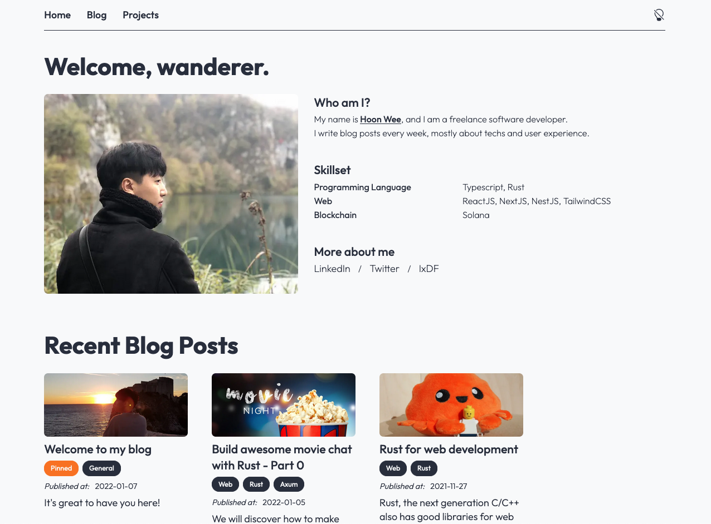
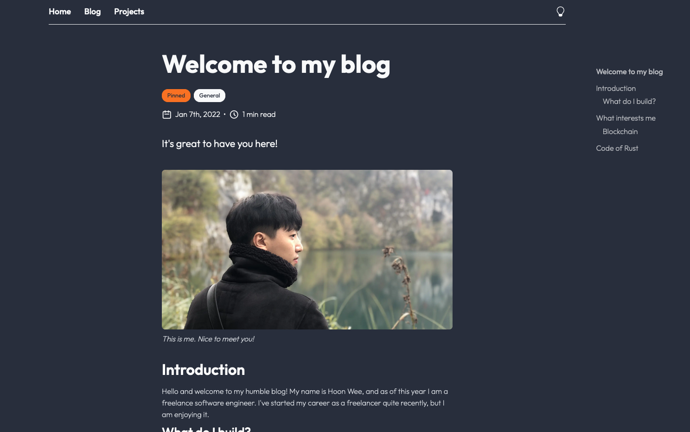

# Hoon's blog
Here I share my code for building my blog :)

## Screenshot
| Main Page - Bright | Blog Post - Dark |
|--------------------|------------------|
|  |  |

# Features 
## Currently Available
- [x] Responsive Design (for desktop, laptop, tablet and mobile)
- [x] Tagged Posts
- [x] Post preview
- [x] Content navigator
- [x] Rendering MDX
- [x] Dark mode
## Todo list
- [ ] Database connection
- [ ] Post comments
- [ ] WYSIWYG like [Notion](https://notion.so)

## Tech Stack
- [Next.js](https://github.com/vercel/next.js/) for building Jam-Stack web.
- [Tailwind CSS](https://github.com/tailwindlabs/tailwindcss) for super easy styling.
- [Content-Layer](https://github.com/contentlayerdev/contentlayer) for processing MDX data.
